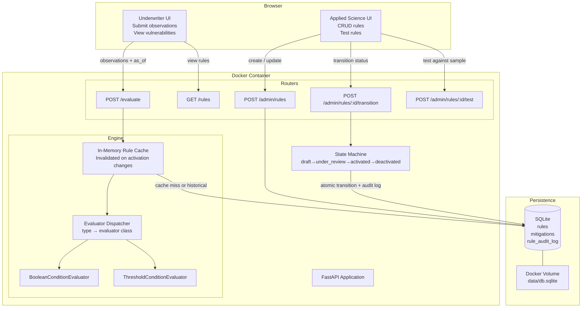

# Design Decisions — Stand Mitigation Rules Engine POC

This document captures the architectural decisions made during the HLD phase, the tradeoffs
considered, and the reasoning behind each choice. It is intended as a reference for the
follow-up review session.

---

## Infrastructure Diagram



**Local dev:** `docker-compose up` — single container, SQLite on a mounted volume.

**Cloud deploy:** same image pushed to a registry, run in AWS ECS or Kubernetes. SQLite
volume becomes a persistent EBS/PVC mount. For higher concurrency, swap SQLite for Postgres
(connection string change only — no application code changes required by design).

---

## Use Case Coverage

Mapping every user story from the spec to the design component that satisfies it.

### Underwriter User Stories

| User Story | Covered By | Notes |
|---|---|---|
| Input observations → find all vulnerabilities | `POST /evaluate` | Returns full vulnerability list with categories and written rules |
| For a vulnerability + property, see available mitigations | `POST /evaluate` response | Each vulnerability includes `full_mitigations` and `bridge_mitigations` inline |
| For a vulnerability, see all possible mitigation options | `GET /rules/{slug}/mitigations` | Returns all mitigations for a rule slug regardless of property observations |
| Run observation against rules at a specific point in time | `POST /evaluate` with `as_of` param | Bypasses cache; queries rules where `activated_at <= as_of AND (deactivated_at IS NULL OR deactivated_at > as_of)` |
| See rules in human-readable format | `written_rule` field on every rule + `GET /rules` | Plain-language field stored on the rule, never reconstructed from code logic |

### Applied Science User Stories

| User Story | Covered By | Notes |
|---|---|---|
| Add new rules | `POST /admin/rules` | Creates rule at `draft` status; mitigations created in same request |
| Delete rules | `POST /admin/rules/{id}/transition` → `deactivated` | Soft delete only — append-only model preserves audit trail. Hard delete is intentionally not exposed. |
| Update existing rules | `PUT /admin/rules/{id}` for drafts; `POST /admin/rules` with same `slug` for activated rules | Draft rules are mutable in place. Activated rules are immutable — updating creates a new version which deactivates the old one atomically. |
| Test new rules before activating | `POST /admin/rules/{id}/test` | Accepts sample observations, runs the rule through the evaluator, returns what it would produce — without touching active rules or the cache |

### Cross-Cutting Concerns

| Concern | Covered By |
|---|---|
| Policy holders don't feel a moving target | Append-only versioning + `as_of` query — the evaluation that produced a policy can always be reproduced exactly |
| Bridge mitigation count tracking | `summary.bridge_mitigation_count` in evaluation response — surfaced to underwriter for policy limit checks |
| Unmitigatable vulnerabilities (e.g. Home-to-Home Distance) | Rules with no mitigations return an empty mitigation list; `summary.unmitigatable_count` flags these explicitly |
| Audit trail for rule changes | `rule_audit_log` — every state transition records author, from/to status, timestamp, and note |
| ACID guarantees on state transitions | SQLite transaction wraps status update + `activated_at`/`deactivated_at` write + audit log insert atomically |
| Developer extensibility | Evaluator dispatch registry — new evaluator type is one new class + one dict entry, no changes to routing or orchestration logic |

### Known Gaps (Intentional POC Scope Decisions)

| Gap | Rationale |
|---|---|
| Bridge mitigation limit enforcement | Limits are policy-level business logic, not rules-engine logic. The engine surfaces the count; enforcement belongs in a policy management system. |
| Authentication / authorisation | Out of scope for POC. In production, underwriter and Applied Science routes would sit behind role-based auth. |
| Persistent evaluation history | The engine evaluates on demand and returns results. Storing evaluation results per policy/property is a policy management concern, not a rules engine concern. |
| Rule conflict detection | Two rules with overlapping slugs or contradictory conditions are not detected automatically. Applied Science review process is the control. Future: automated conflict linting. |

---

## Decision Table

| Decision | Choice |
|---|---|
| Rule engine | Hybrid typed evaluators + data |
| Stack | FastAPI + SQLite |
| Frontend | Minimal UI — Underwriter primary, Applied Science secondary tab |
| Rule lifecycle | `draft → under_review → activated → deactivated` |
| Versioning | Append-only rows with `activated_at` / `deactivated_at` timestamps |
| Transactions | ACID via SQLite |
| Containerization | Docker (primary) — single Dockerfile + docker-compose for local and cloud deploy |
| Audit trail | `rule_audit_log` table — author, state transitions, timestamps |
| Performance | Python suitable for foreseeable future; evaluation overhead is negligible fraction of total round-trip. In-memory cache of active ruleset eliminates repeat DB fetches. Scale path: horizontal Docker containers → Postgres migration at high concurrency → rule design audit before any infra rewrite. |

---

## Rule Engine Architecture

### The three options considered

**Option A — Rules-as-Code (Strategy Pattern)**
Each rule is a versioned Python class implementing a shared interface. Applied Science adds
rules by writing new classes.

- Rejected because: Applied Science must write code to add rules. Versioning code snapshots
  in a database is awkward. Time-based querying requires storing and loading serialized code,
  which introduces security and maintainability concerns.

**Option B — Rules-as-Structured-Data (DB-Driven DSL)**
Rules are stored entirely as JSON in the database. A generic evaluator interprets them at
runtime. No code changes needed to add new rules.

- Rejected because: complex rules (e.g., distance thresholds with multiplicative modifiers)
  are very hard to express in a generic condition schema. The schema inevitably grows into a
  full expression language, which reintroduces the governance problems of a DSL without the
  benefits of a real one.

**Option C — Hybrid Typed Evaluators + Data (chosen)**
Rules are stored as data but include a `type` field that dispatches to a named evaluator for
computation. Simple rules use a generic `boolean_condition` evaluator. Complex rules use a
`threshold_condition` evaluator. Both evaluators are data-driven — Applied Science configures
them through structured JSON params, no code required for new rule instances.

- Chosen because: simple rules require zero code changes (just DB inserts). Complex rules are
  handled by purpose-built evaluators with full expressiveness. Time-based versioning works at
  the data layer. The separation is clean: data owns "what the rule is", code owns "how to
  compute it".

---

## Evaluator Types

### `boolean_condition`

Evaluates a rule by walking a condition tree of logical operators and field comparisons.
Supports: `eq`, `in`, `gte`, `lte`, `and`, `or`, `not`.

Example — Roof rule:
```json
{
  "type": "boolean_condition",
  "condition": {
    "or": [
      { "eq": [{ "field": "roof_type" }, "Class A"] },
      {
        "and": [
          { "eq": [{ "field": "wildfire_risk_category" }, "A"] },
          { "in": [{ "field": "roof_type" }, ["Class A", "Class B"]] }
        ]
      }
    ]
  }
}
```

Covers: Attic Vent, Roof, Home-to-Home Distance, and the majority of expected future rules.

### `threshold_condition`

Evaluates a rule by computing a dynamic threshold from a base value and a set of modifiers,
then comparing the actual observed measurement against that threshold.

Modifier map shape: `{ <observation_field>: { <observed_value>: { "op": <operation>, "value": <number> } } }`

Supported operations: `multiply`, `divide`, `add`, `subtract`.

Example — Windows Vegetation Distance rule:
```json
{
  "type": "threshold_condition",
  "params": {
    "base_value": 30,
    "subject_field": "vegetation",
    "measurement_field": "distance_to_window",
    "type_field": "type",
    "modifiers": {
      "window_type": {
        "Single":         { "op": "multiply", "value": 3 },
        "Double":         { "op": "multiply", "value": 2 },
        "Tempered Glass": { "op": "multiply", "value": 1 }
      },
      "type": {
        "Tree":  { "op": "multiply", "value": 1 },
        "Shrub": { "op": "divide",   "value": 2 },
        "Grass": { "op": "divide",   "value": 3 }
      }
    }
  }
}
```

### Why not a DSL?

A full DSL was considered and rejected. The concern is not expressiveness — it is governance.
Once Applied Scientists can write arbitrary expressions, the system requires:
- A parser with good error messages
- A sandbox to prevent side effects or infinite loops
- A review process capable of reasoning about arbitrary logic
- Version-controlled test suites per expression

The four-operation vocabulary (`multiply`, `divide`, `add`, `subtract`) avoids all of this.
It is a closed enum, not a grammar. Validation is a single membership check. An Applied
Scientist cannot write a loop or a side effect with `{ "op": "multiply", "value": 3 }`.

**The governance boundary:** new operation vocabulary requires a code change and a PR review.
What Applied Scientists control is the modifier map data — which fields, which values, which
of the four approved operations. New rule *instances* of existing types require only a DB
insert. New rule *types* require a developer. This boundary is intentional and should be
preserved.

A DSL remains a valid future path if the operation vocabulary proves insufficient, but it
requires governance infrastructure (linter, sandbox, review tooling) before adoption.

---

## Rule Identity and Categories

Rules are uniquely identified by `slug` (e.g., `windows_vegetation_distance`), not by name.
A `category` field groups rules by the property component they assess (e.g., `windows`,
`roof`, `attic`).

This allows multiple independent rules per component. For example:
- `windows_vegetation_distance` and `windows_seal` are distinct rules, independently
  evaluable, independently mitigatable, independently versioned — but both grouped under
  `windows` for display.

The underwriter sees "2 window vulnerabilities." Each has its own mitigations. Failing one
does not imply anything about the other.

---

## Rule Lifecycle and Versioning

Rules follow a lifecycle: `draft → under_review → activated → deactivated`.

Versioning is append-only: "updating" a rule creates a new row and deactivates the old one.
A rule's stable identity across versions is its `slug`. Time-based queries use:
`WHERE activated_at <= :as_of AND (deactivated_at IS NULL OR deactivated_at > :as_of)`.

This directly addresses the underwriter user story: *"I want to run an observation against
the rules engine at a specific point in time so that policy holders don't feel like there is
a moving target."* The evaluation is locked to the rules that were active on the date of
the original assessment.

All state transitions are recorded in `rule_audit_log` with author, timestamp, from/status,
to/status, and a change note. This gives Applied Science a full audit trail and supports
accountability for rule changes.

ACID transactions (guaranteed by SQLite) ensure that deactivating the old version and
inserting the new version either both succeed or both fail. No partially-applied rule updates.

---

## Mitigation Composability

**Full mitigations short-circuit:** if a full mitigation is confirmed applied, the
vulnerability is resolved entirely. No further evaluation needed.

**Bridge mitigations stack:** each bridge mitigation is a modifier function
`(current_threshold) → new_threshold`. They are applied in sequence. Each is self-contained
and does not need to know about other mitigations. Adding a new bridge mitigation type means
registering a new modifier function — it does not require changes to the evaluation loop.

Bridge mitigations are counted per property. The system tracks how many bridge mitigations
have been applied, as they are subject to policy limits.

---

## Performance

Active rule count is assumed to stay under 2,000 for the foreseeable future. This assumption
is controlled by the parameterized rule design: one `Roof` rule with a `wildfire_risk_category`
parameter covers all geographic variations. If rule count approaches 10,000+, that is a signal
the Applied Science team has stopped parameterizing and started duplicating — a process problem,
not an infrastructure one.

At under 2,000 rules, Python evaluation with an in-memory cache of the active ruleset takes
well under 12ms. Python is suitable for this scale — evaluation overhead is a negligible
fraction of the total request round-trip (DB query + network latency dominate). A language
rewrite to Java or Rust would recover single-digit milliseconds while the network costs tens
of milliseconds. Not a worthwhile trade.

Scale path if needed:
1. Horizontal scaling via Docker containers behind a load balancer
2. Postgres migration if SQLite single-writer becomes a concurrency bottleneck
3. Rule design audit before any infrastructure rewrite — high rule counts are a design smell

---

## Containerization

Docker is a primary requirement. The evaluator should be running the demo with
`docker-compose up` and nothing else. This serves two purposes:
1. Evaluators of this project can run the demo themselves without a local Python setup
2. The Docker image is the deployment artifact — the same container runs locally and in
   AWS ECS, Kubernetes, or any other cloud provider

---

## Future Work

- **DSL for rule conditions:** only if the four-operation vocabulary proves insufficient.
  Requires governance infrastructure (linter, sandbox, review tooling) before adoption.
- **CDN / edge caching of evaluation results:** valid if underwriter traffic grows
  significantly. Not warranted for current expected user volume.
- **Postgres migration:** warranted when SQLite single-writer lock becomes a concurrency
  bottleneck under high request volume.
- **Rule pre-filtering by observation field:** if active rules grow beyond ~10,000, index
  rules by the observation fields they depend on and pre-filter before loading into memory.
- **Categories table:** normalize `category` from a string field into a table with display
  metadata (label, description, icon, ordering) if the UI needs richer presentation.
- **Applied Scientist rule testing sandbox:** a dedicated interface to run a rule in `draft`
  status against example observations before promoting to `under_review`.
